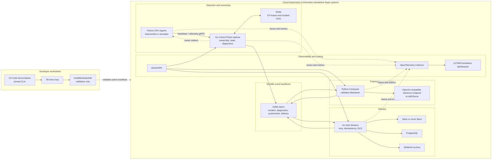

# Aegis



## Overview

Aegis is an out-of-path control plane for GPU and AI infrastructure. Python GPU Agents stream heartbeats and telemetry to Go Control Plane replicas. The Control Plane owns sharding, deterministic failure detection, incident state, diagnostics coordination, Redis-backed leases and locks, and Kafka event publication. Postmortem composition and delivery run downstream through Kafka so control-plane decisions stay deterministic.

The MVP treats vLLM, KServe, Triton, custom inference servers, Slack, PostgreSQL, and S3-compatible storage as external systems. Aegis integrates with them through narrow adapters and never lets the AI endpoint decide whether a worker failed.

## Problem Statement

GPU workers can overheat, exhaust VRAM, crash model servers, accumulate ECC errors, or disappear during network partitions. Teams need a deterministic control plane that detects these signals quickly, preserves diagnostic context, produces a useful incident postmortem, and fans it out without coupling failure detection to delivery systems.

## Architecture Summary

- Python Agents identify with stable `worker_id` values and connect through bootstrap Control Plane URLs.
- Go Control Plane replicas register only themselves in Redis and build an in-memory consistent hash ring from CP membership.
- A receiving CP either owns the worker stream or returns a normal network address redirect hint.
- Worker state moves through `HEALTHY -> SUSPECTED -> DIAGNOSTICS_TRIGGERED -> DIAGNOSTICS_COLLECTED -> POSTMORTEM_REQUESTED -> POSTMORTEM_GENERATED -> DELIVERY_IN_PROGRESS -> DELIVERED/DELIVERY_FAILED -> RESOLVED`.
- Kafka carries incident, diagnostic, postmortem, delivery, retry, and DLQ events in a common envelope.
- The Composer calls an OpenAI-compatible endpoint only after deterministic incident detection.
- Go Sink Workers deliver to Slack, PostgreSQL, and S3/MinIO with idempotency and explicit retry/DLQ behavior.

## Cloud Deployment Notes

Kubernetes is the target runtime. Helm and Kustomize install standalone Aegis services plus Kafka, Redis, PostgreSQL, MinIO, OpenTelemetry Collector, observability, mock Slack, and an OpenAI-compatible inference endpoint such as vLLM or KServe. Kubernetes provides DNS, scheduling, config, health checks, secrets, and autoscaling primitives; Aegis code owns shard routing, ownership redirects, failure detection, state transitions, and correlation propagation.

## Local Validation

Use the three-layer model:

1. Developer filesystem stores the repository.
2. VS Code Devcontainer provides pinned toolchains and CLIs.
3. Kind, Minikube, or k3d runs the actual workloads.

From inside the Devcontainer:

```sh
make kind-up
tilt up
```

Tilt applies Helm/Kustomize artifacts and uses live update rules so Python source syncs without full image rebuilds, Go changes rebuild only the affected binary, and stateful infrastructure does not restart for app edits.

## Services

- `aegis-control-plane`: Go CP for ownership, ingestion, failure detection, incident locks, diagnostics, and Kafka publication.
- `aegis-agent`: Python GPU/AI worker monitor with synthetic failure modes and diagnostics buffer.
- `aegis-composer`: Python Kafka consumer that reads diagnostics requests, calls an OpenAI-compatible inference endpoint, validates Markdown, and publishes generated postmortems back to Kafka.
- `aegis-sink-worker`: Go Kafka consumer that delivers postmortems to Slack, PostgreSQL, and S3/MinIO.
- `mock-slack`: non-production webhook receiver.

## Kafka Topics

- `aegis.incident.detected`
- `aegis.diagnostics.requested`
- `aegis.diagnostics.collected`
- `aegis.postmortem.requested`
- `aegis.postmortem.generated`
- `aegis.postmortem.delivery.requested`
- `aegis.postmortem.delivery.status`
- `aegis.postmortem.delivery.retry`
- `aegis.postmortem.delivery.dlq`

## Workflows

Postmortem workflow:

```text
Agent -> gRPC telemetry -> CP -> deterministic incident -> Kafka -> Composer -> AI endpoint -> Kafka generated postmortem
```

Sink fanout workflow:

```text
Kafka generated postmortem -> Go Sink Workers -> Slack + PostgreSQL + S3 -> status/retry/DLQ topics
```

Configuration details live in `docs/configuration.md`. Two important switches are `AEGIS_TELEMETRY_DATA_SOURCE=GPU|MOCK` for the Agent and `AEGIS_LLM_BASE_URL` for the Composer's OpenAI-compatible inference endpoint.

## Observability

All services emit structured logs, metrics, and traces through OpenTelemetry Collector. Correlation IDs cross gRPC, Kafka, composer, sinks, and owner redirects. Required metrics include active agents, missed heartbeats, incidents, diagnostics, postmortem latency, Kafka lag, delivery status, DLQ count, CP queue depth, `ResourceExhausted`, redirect count, ring rebuild count, Redis polling errors, lock failures, and AI latency/failures.

Dashboards live under `observability/dashboards/` and cover CP health, Agent health, Kafka pipeline, postmortem generation, sink delivery, ring membership, and chaos/performance runs.

## Testing

```sh
make test-python
make test-go
```

Root-level test layout:

- `tests/unit/`: isolated unit tests.
- `tests/integration/`: component-boundary tests that write artifacts to `/reports/integration/`.
- `tests/e2e/`: a few full-system scenarios.
- `tests/chaos/`: resilience and performance tests that write artifacts to `/reports/chaos/`.

## KEDA Scaling

KEDA ScaledObjects use CP queue depth and active agents for the Control Plane, Kafka lag for Composer and Sink Workers, and latency/concurrency signals for the optional local AI server. CPU and memory HPAs remain fallback scalers.

## Helm, Kustomize, and Terraform

Helm owns the reusable cloud chart under `infra/helm/aegis`. Kustomize overlays under `infra/kustomize/overlays/local` and `infra/kustomize/overlays/cloud` apply small environment differences. Terraform under `infra/terraform/local` is optional and provisions foundations only; Aegis must deploy into an existing cluster without Terraform.

## Technologies Used

Languages and protocols: Go, Python 3.13, protobuf, gRPC, JSON event envelopes, Markdown.

Distributed systems: consistent hashing with virtual nodes, Redis TTL membership leases, Redis incident locks, bounded queues, min-heap heartbeat expiry, deterministic incident IDs, idempotent Kafka consumers, retry and DLQ topics.

Infrastructure: Kubernetes, Helm, Kustomize, Kind, Minikube/k3d-compatible overlays, Tilt, KEDA, Terraform, VS Code Devcontainers.

Data and messaging: Kafka, Redis, PostgreSQL, S3-compatible storage, MinIO for local validation.

Observability: OpenTelemetry Collector, Prometheus-style metrics, Grafana dashboards, Loki-compatible logs, trace correlation IDs.

AI integration: OpenAI-compatible inference endpoint such as vLLM or KServe.

Security and hardening: Kubernetes Secrets, optional gRPC mTLS wiring, Kafka authentication and ACL notes, Redis authentication, NetworkPolicy, least-privilege ServiceAccounts, rate limiting, secret rotation notes.

Version pins are tracked in `VERSION_LEDGER.md`.
